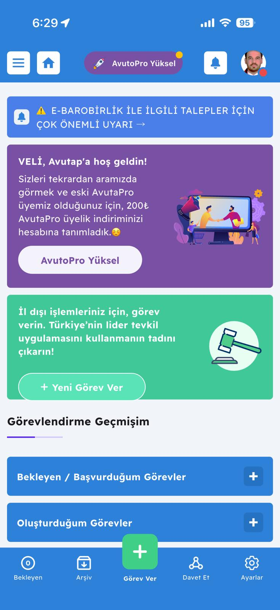
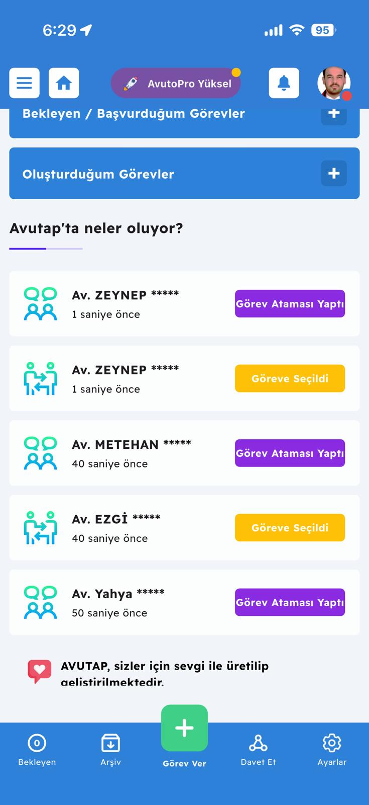

# AVUTAP Mobile App — UI/UX Analizi

> **Kaynak:** 22 adet ekran görüntüsü (avutap-app-images/) — iOS, Mayıs 2026
> **Amaç:** AVUTAP iOS uygulamasının ekran ekran tasarım, akış ve özellik dökümü. Bizim tasarımımız için referans + farklılaştırma fırsatları.
> **Test cihazı:** Av. Veli Onur Biçimli'nin gerçek hesabı (Bursa, eski AvutaPro üyesi → 200₺ indirimle yeniden upsell ediliyor)

## Genel Tasarım Sistemi

### Renk paleti

| Rol | Renk | Kullanım |
|---|---|---|
| Primary (header, CTA links) | Mavi `#3B82F6` ton | Header, sekme aktif, link |
| Premium tier | Mor `#7C3AED` ton | AvutoPro pill, premium banner |
| Success / primary CTA | Yeşil `#22C55E` ton | "Görevi Oluştur", "+" FAB, yeşil banner |
| Warning / secondary action | Sarı/Turuncu | "Göreve Seçildi" badge, "Hazır Açıklamalar" butonu |
| Error / critical | Kırmızı | Boş durum uyarıları, profil eksik mesajı |
| Neutral | Beyaz, açık gri | Card bg, separator |

### Tipografi
- Sans-serif (San Francisco / SF Pro varsayımıyla)
- Header'larda **bold uppercase** isimler (VELİ ONUR BİÇİMLİ)
- Body text okunabilir, hiyerarşik — h1 (24-26pt) > h2 (20pt) > body (16pt)

### Layout patternleri
- **Card-based** (rounded corners ~12pt)
- **Header her ekranda sabit** (hamburger menu + home + AvutoPro pill + bell + avatar)
- **Bottom navigation 5 sekmeli**: Bekleyen | Arşiv | **+ Görev Ver (FAB)** | Davet Et | Ayarlar
- **Empty state**: illüstrasyon + açık mesaj + sub-info
- **Modal / popup**: blurred dark overlay + alt-yarıdan slide-up

### Sürekli görünen UI elemanları
- **AvutoPro Yüksel** mor pill — her ekranda üstte → **agresif premium upsell**
- Profil avatarında **kırmızı bildirim noktası** (eksik profil veya yeni bildirim)
- Bildirim zili (top-right) her ekranda

---

## Ekran ekran döküm

### 1. Ana Sayfa (Hoş geldin)

**İçerik:**
- ⚠️ **Bilgilendirme banner**: "E-BAROBİRLİK İLE İLGİLİ TALEPLER İÇİN ÇOK ÖNEMLİ UYARI →" (admin'den yönetilen duyuru)
- 🟣 **Kişiselleştirilmiş upsell card**: "VELİ, Avutap'a hoş geldin! Sizleri tekrardan aramızda görmek ve eski AvutaPro üyemiz olduğunuz için, **200₺ AvutaPro üyelik indiriminizi** hesabına tanımladık 😏" + el-sıkışma görseli + "AvutoPro Yüksel" CTA
- 🟢 **Birincil CTA card**: "İl dışı işlemleriniz için, görev verin..." + tokmak (gavel) görseli + "+ Yeni Görev Ver" buton
- **Görevlendirme Geçmişim** widget (mini progress bar)
- **Bekleyen / Başvurduğum Görevler** ve **Oluşturduğum Görevler** expandable cards (+ icon)

**Çıkarımlar:**
- Eski premium üyelere **kişiselleştirilmiş indirim** = etkili reaktivasyon
- Banner sistemi → admin'den canlı içerik yayını
- "Görevlendirme Geçmişim" = kullanıcının kendi aktivite tracker'ı

### 2. Ana Sayfa — Canlı Feed

**İçerik:**
- "**Avutap'ta neler oluyor?**" başlık + progress bar
- Liste formatında **anonim aksiyon feed**:
  - `Av. ZEYNEP *****` `1 saniye önce` `[Görev Ataması Yaptı]` (mor badge)
  - `Av. ZEYNEP *****` `1 saniye önce` `[Göreve Seçildi]` (sarı badge)
  - `Av. METEHAN *****` `40 saniye önce` `[Görev Ataması Yaptı]`
  - `Av. EZGİ *****` `40 saniye önce` `[Göreve Seçildi]`
  - `Av. Yahya *****` `50 saniye önce` `[Görev Ataması Yaptı]`
- Her satırda 2 ikon: **konuşma balonu + insanlar** (atama) veya **el sıkışma okları** (seçim)
- Footer: "AVUTAP, sizler için sevgi ile üretilip geliştirilmektedir. ❤️"

**Çıkarımlar:**
- **KVKK uyumlu anonimleştirme** — sadece ilk isim + `*****`
- Aksiyon tipleri renk kodlu (mor=atama yapan, sarı=seçilen)
- 1 saniye önce timestamps → backend gerçekten gerçek zamanlı veri akıtıyor (polling değil websocket olabilir)

### 3. Bekleyen Görevler — Empty State

.jpeg)

**İçerik:**
- 🔴 Kırmızı uyarı: "**Şuan bekleyen görev bulunmamaktadır.**"
- 🟠 Bilgi notu: "Bekleyen görev hakkında detaylı bilgi almak için dokun."
- Şehir manzarası illüstrasyon (sade, dostane)

**Çıkarımlar:**
- Boş durumlar **hiç boş değil** — bilgi notu + görsel
- Renk hiyerarşisi: kırmızı (durum) > turuncu (bilgi) > illüstrasyon (rahatlık)

### 4. Arşiv — Atama Yapılanlar / Tamamlananlar

.jpeg)

**İçerik:**
- İki sekme: **Atama Yapılanlar** (aktif, mavi) / Tamamlananlar
- Bilgi şeridi: "📋 Atama yapılan son 10 görev gösterilmektedir."
- Her görev satırı:
  - Sol avatar (görev veren), sağ avatar (görev alan)
  - `İL → Adliye` formu (ör. `BURSA → Bursa Adliyesi`, `İSTANBUL → Bakırköy Adliyesi`, `İSTANBUL → Erdek Adliyesi`)
  - Görev tipi (`Ceza Duruşması Katılım`, `Hukuk Duruşması Katılım`)
  - Ücret (`1100 TL`, `1250 TL`)

**Çıkarımlar:**
- **İki avatarlı görev kartı** = arası ilişki net (kim kimi seçti görsel)
- Birinin profilinde mavi tik var (`✓` rozeti) — verification!
- Default avatar var (siluet) — fotoğraf yüklemeyenlere
- "Son 10 görev" = pagination yerine snapshot (mobile için akıllı)

### 5. Görev Ver Formu — Üst

.jpeg)

**İçerik (alanlar sırasıyla):**
1. Bilgi notu (üstte): "...seçeneğini aktifleştirerek görevlendirme konumunuzu aratarak seçiniz."
2. **Görev Yeri** → "Görev İlini Seçiniz" (dropdown)
3. **Görev Adliyesi** → "Görev Adliyesini Seçiniz" + sağda **"Adliye Dışı" toggle**
4. **Yapılacak Görev** + ℹ️ (bilgi tooltip) → "Yapılacak Görevi Seçiniz" (dropdown)
5. **Görev Bütçeniz** + ℹ️ → "Görev Bütçenizi Seçin" (dropdown — sabit kademeler)
6. **Görevin Yapılacağı Tarih** → date picker
7. **Görev Saati** — *"(Saat önemli değilse boş bırakabilirsiniz.)"* → "Örn: Duruşma saati, işlem saati vb."

**Çıkarımlar:**
- ℹ️ **bilgi tooltip ikonları** her kritik alanda
- **Adliye Dışı toggle** = lokasyon araması ile harici görev (icra dairesi, müşteri adresi, vb.)
- **Bütçe dropdown'ı** = serbest girdi yerine sabit kademe → admin tarafında ücret tutarlılığı
- **Saat opsiyonel** mesajı = mobile-friendly esneklik

### 6. Görev Ver Formu — Alt

.jpeg)

**İçerik:**
- **Görev Açıklamanız** + sağda **"🔍 Hazır Açıklamalar"** butonu (turuncu)
- Açıklama text-area: "Yapılacak göreviniz ilgili kısa açıklama giriniz. **Lütfen açıklamanıza iletişim bilgisi yazmayınız.**" (placeholder)
- 🟢 **"Görevi Oluştur"** prominent buton

**Çıkarımlar:**
- **Hazır şablonlar** üstte değil **inline** (yazarken erişilebilir)
- "İletişim bilgisi yazmayınız" = **anti-bypass guard** (platform dışı pazarlık önleme)
- Yeşil CTA = success aksiyonu

### 7. Davet Et — Paylaş Kazan

.jpeg)

**İçerik:**
- 👤 Karikatür illüstrasyon (paylaşım okları + insanlar)
- **"Paylaş Kazan!"** mavi başlık
- Açıklama: "Meslektaşlarınızı referans adresinizle sisteme davet ederek, **doğrulanmış üye başı 10 ₺ kazanın.** 😎"
- **Referans Linkiniz** card: `https://www.avutap.com.tr/registe...` + paylaş + kopyala butonları
- **Referanslarım** liste (bu kullanıcı için boş)

**Çıkarımlar:**
- ₺10 referral bonus (₺20 değil — anasayfa/İş Ortaklığı sayfasıyla **3. tutarsızlık**)
- "Doğrulanmış üye" = onaylanma sonrası → fraud koruması
- Direkt link + paylaş + kopyala 3 buton = sürtünme minimum

### 8. Ayarlar — Üst

.jpeg)

**İçerik (sırasıyla):**
- **Görev alma durumu** toggle (kapalı görünüyor) → *"Görev almak istemiyorsanız, kapalı yapınız."*
- 👤 **Kişisel Bilgilerim**
- 📋 **Görev Alma Adliyeleri** (multi-select)
- ❌ **Görev Almak İstemediğiniz Kategoriler** (opt-out!)
- 🔔 **Görev Bildirim Ayarları**
- 🟢 **Profil Doluluk Oranı** (yarı dolu progress yeşil)
- 🖼 **Profil Resmi Değiştir**
- 🔒 **Şifremi Değiştir**
- 📑 **Yetki Belgesi**
- 🟠 **Kısıtlamalar** (orange badge **"1"** — bir kısıtlama var)
- ✓ **Mavi Tik Başvurusu**

**Çıkarımlar:**
- **"Görev Almak İstemediğiniz Kategoriler"** — kullanıcıya tip bazında **opt-out**
- **Profil Doluluk Oranı** — gamification + completeness incentive
- **Yetki Belgesi** — uygulamadan yönetilebilir (yasal araç!)
- **Kısıtlamalar (1)** — kullanıcı uyarı/yaptırım sistemi (iptal limiti aşımı vb.)
- **Mavi Tik** — verification badge sistemi (Twitter/Instagram tarzı güven sinyali)

### 9. Ayarlar — Alt

.jpeg)

**İçerik (devamı):**
- 📑 **Kullanıcı Sözleşmeleri**
- 🚪 **Çıkış Yap** (kırmızı)

### 10. Drawer Menu — Türkiye Header (top)

.jpeg)

**İçerik:**
- **Hero görsel**: Boğaz manzarası, "Türkiye" italik el yazısı, martılar — sezonsal/günsel değişebilir görsel
- **Logo:** "Avutap" (orange-purple gradient)
- 🔵 **"İyi Haftalar."** günsel selam
- Menü:
  - 🏠 Ana Sayfa
  - 📋 Görev İşlemleri >
  - 💼 İş Ortaklığı >
  - 📋 Görev İptal Bildirimi
  - 💬 Uyuşmazlık Masası
  - 📋 Duyurular
  - ⚙️ Ayarlar
  - ❓ Nasıl Çalışır?
  - 📝 İstek/Öneri/Şikayet
- Alt: 🚪 (çıkış ikonu)

**Çıkarımlar:**
- **Sezonsal/zamana duyarlı görsel** = yaşıyor hissi (TEVKİL'den majör fark)
- **Günsel selam** ("İyi Haftalar." Pazar+Pazartesi mantıklı, "İyi Akşamlar." gece gibi)
- 9 menü item — kapsamlı (Drawer + Bottom Nav birlikte 14 nav nokta)

### 11. Drawer — Side görseli + Görev İşlemleri açık

.jpeg)

**İçerik:**
- **Header görseli değişmiş** — antik tapınak (Side'daki Apollo Tapınağı muhtemelen)
- **Görev İşlemleri** açılmış (chevron down):
  - 🔵 **Bekleyen görevlerim** `(0)` badge
  - ➕ Oluşturduğum Görevler
  - 🧑‍🤝‍🧑 Seçildiğim Görevler
  - 📤 Başvurduğum Görevler
  - ✅ Tamamlanan Görevler
  - 📋 Başvurmadığım Görevler
- İş Ortaklığı > (kapalı)
- Görev İptal Bildirimi
- Uyuşmazlık Masası

**Çıkarımlar:**
- **Drawer header görseli rotasyon** = farklı şehirler/manzaralar → engagement
- **Görev İşlemleri = 6 alt liste** (BASE'de 7 dedik — eşleşiyor!)
- Bekleyen sayısı **inline badge** olarak gösteriliyor

### 12. Drawer — İş Ortaklığı açık

.jpeg)

**İçerik:**
- Görev İşlemleri kapalı
- **İş Ortaklığı** açılmış:
  - 💵 **İş Ortaklığı : 0 ₺** (mevcut bakiye)
  - ➕ **Davet Et Kazan**
  - 🧑‍🤝‍🧑 **Görev Ver Kazan**
  - 📤 **Ödeme Talebi Oluştur**
- Görev İptal Bildirimi
- Uyuşmazlık Masası
- Duyurular
- Ayarlar
- Nasıl Çalışır?

**Çıkarımlar:**
- **Bakiye drawer'da prominent** — pasif gelir motivasyonu sürekli görünür
- **3 kazanım yolu** (davet et / görev ver / ortaklık talebi)

### 13. Uyuşmazlık Masası

.jpeg)

**İçerik:**
- 🟠 Üst uyarı: "**Uyuşmazlık Masası ne için kullanılır?** Bilgi almadan, kullanmayınız."
- 🟢 **"Uyuşmazlık Oluştur"** (dark green CTA)
- ℹ️ **Modal popup**: "Avutap'ın daha güvenilir bir platform olması için, görevlendirmelerinizle ilgili uyuşmazlıkları çözüme kavuşturmak için lütfen talep oluşturunuz. Talebiniz uyuşmazlık yaşadığınız meslektaşınıza iletilip, **AVUTAP yetkilileri dahilinde görüşmeye açılacaktır**."
- "Anladım" yeşil onay butonu

**Çıkarımlar:**
- Hak istismarı önleme: önce uyarı, sonra eylem
- Modal pattern = onboarding/eğitim
- "AVUTAP yetkilileri dahilinde" = admin moderation

### 14-19. Nasıl Çalışır? Akordeon FAQ

Birden fazla expand/collapse SSS bölümü:

**14. Görevlendirme Oluşturma** (10. ekran):
> "Yeni Görev Aç ekranında açmış olduğunuz, görevlendirmeleriniz **sadece 15 dakika açık durmakta** ve sonuçlanmaktadır. Görev süreniz bittikten sonra görevinize gelen başvuruları görerek avukat atamanızı yapabilirsiniz... Yeni gelen **'Acil Görev'** özelliğimiz ile 15 dakika beklemeden başvuruları görüntüleyip atama sağlayabilirsiniz."

**15. Görevlendirme Sistemi Nasıl Çalışır** (11. ekran):
> "Görevin oluşturulduğu adliyede ki tüm avukatlarımıza açılan görev iletilir. Seçili adliyelerinizden, oluşturulan görevler hemen **Bekleyen Görevim menünüze düşer**. Göreve kabul başvurusu gönderme süreniz **15 dakikadır**. 15 dakika sonunda görevlendirme sistem tarafından kaldırılmaktadır. (Acil görevlendirmeler her an atama alabilir ve 15 dakika dolmadan başvuruya kapanabilir)... **AvutaPro üyelerimize anında Robot Arama, SMS ve E-Mail ile bilgi verilir. Normal üyelerimize E-mail ile bilgi verilir.**"

**16. Görev Kabul** (12. ekran):
> "Oluşturulan görevlendirmeler de, gelen başvurular da avukat ataması görevi oluşturan meslektaşınız yapmaktadır. **Sistem olarak bizler görevin kime atanacağını belirlememekteyiz.** Hiç atama yapılmayan veya atanmadığınız görevlendirmeler için sorumluluğumuz olmamaktadır... Görevlendirmeye seçilmeniz durumunda sizlere SMS bilgisi gelir ve Başvurduğunuz görevde 'Seçildiniz iletişime geçiniz' uyarısı alırsınız. Görüntüle butonu ile meslektaşınızın bilgilerine ulaşırsınız. **Seçilmediğiniz görevler için 'Görev için başkası seçildi' uyarısı alırsınız.**"

**17. Adil Görev Atama Algoritması (ÖNEMLİ)** (13. ekran):
> "Adil görev atama algoritmasını öğrenmek için **buraya** tıklayınız." (external link)

**18. Göreve Başvurular Nasıl Görünür?** (14. ekran):
> "Görevi oluşturan meslektaşınız, gelen başvurularda sizlerin **sadece isim ve soyisminizin baş harfleri** bunun yanında Ayarlar bölümünden girmiş olduğunuz hakkımda ve uzmanlık alanlarınızı görür. **Profil resmi, isim soyisim, gibi haksız rekabete yol açabilecek bilgiler görev atanana kadar görülmemektedir.**"

**19. Görev Bildirim Ayarları** (15. ekran):
> "Görev bildirimlerinizin ayarlarını, Ayarlar > Bildirim Ayarları bölümünden, Bildirim Türüne göre Açık/Kapalı olarak düzenleyebilirsiniz. Hiç görev almak istemiyorsanız Ayarlar > Görev Durumunuzu Kapalı olarak işaretleyebilir, istediğiniz zaman tekrar AÇIK yapabilirsiniz."

**Çıkarımlar (Nasıl Çalışır akordeonu):**
- 🚨 **Atamayı sistem değil, görev veren yapar** — komisyonculuk yasağı (Md. 48) yorumu — "haksız rekabet" engelleyici
- **Anonim başvuru** = görev veren, başvuranın sadece isim baş harfi + uzmanlığını görür → KVKK + adil dağılım
- **Adil Atama Algoritması** linki dış sayfaya — opaque tutulmuş (ticari sır)
- 15 dk açık → sistem otomatik kaldırır
- AvutaPro VS Normal: **bildirim kanal farkı en büyük value prop**

### 20. İstek/Öneri/Şikayet Formu

.jpeg)

**İçerik:**
- ℹ️ Bilgi: "Önerilerinizi ve AVUTAP'ta almış olduğunuz hataları bizlere iletebilirsiniz. Almış olduğunuz **sistemsel hata ve teknik sorunları daha detaylı incelememiz için lütfen ekran resmi alıp bizlere EK olarak gönderiniz.**"
- **Kategori** (dropdown)
- **Başlık** (text input)
- **Açıklama** (textarea)
- 🟢 **"Oluştur"** buton

**Çıkarımlar:**
- "Ekran resmi" beklentisi → user-generated debugging
- Form basit, 3 alan + dropdown

### 21. AvutaPro Satın Alma Ekranı (TAM PRİCİNG!)

.jpeg)

**İçerik:**
- Header: "elere başvurmak için AvutapPro satın almanız gerekm..." (rozet ikonu + truncated)
- 4 madde (her biri rocket ikonu):
  1. **1 yıl boyunca**, Avutap'tan gelen görevlere artık **sınırsız kabul isteği** gönderebilirsiniz.
  2. Seçili adliyelerinizden oluşturulmuş görevlendirmeler için anında **Robot Arama ve SMS** ile bilgilendirilirsiniz.
  3. **Acil görevlendirme oluşturabilirsiniz**.
  4. AvutaPro anında aktifleşecek olup, 1 yılın sonunda almış olduğunuz görev sayısı **3'ün altındaysa, üyeliğiniz ücretsiz uzatılır** (müşteri teyitli).
- 🎉 **Konfeti partikülleri** (kutlama hissi)
- 📞 "Robot arama anonsunun örneğini dinlemek için **tıklayınız**."
- ☑️ "**Ön Bilgilendirme** ve **Mesafeli Satış Sözleşmesi**'ni okudum kabul ettim onaylıyorum"
- Footer: "Size özel **200₺ indirim ile** **2099₺ / Yıllık** [Satın Al]" (yeşil CTA)

**Çıkarımlar — KESİN VERİLER:**
- 🎯 **AvutaPro fiyat: ₺2099/yıl** (200₺ indirimli)
- 🎯 **Normal fiyat: ₺2299/yıl** (200₺ indirim öncesi)
- 🎯 **Free tier'da görev kabul başvurusu LİMİTLİ** (premium'da sınırsız)
- 🎯 **Acil görev = premium-only**
- 🎯 **Robot arama + SMS = premium-only** (free'de sadece e-mail)
- 🎯 **Yıl sonu garantisi: 1 yılda <3 görev → abonelik 1 yıl ücretsiz uzatılır**
- ✅ Robot arama ses örneği dinlenebilir = "denemek için satın almadan"
- ⚖️ Tüketici hukuku gereği Mesafeli Satış + Ön Bilgilendirme onayı zorunlu

### 22. Profil Sayfası (Müşterimizin profili!)

.jpeg)

**İçerik:**
- Üst card: **VELİ ONUR BİÇİMLİ** + 📍 BURSA + Hakkında progress bar
- Sağda yorumlar widget'ı (📝 0)
- İki sekme: **Hakkında** (aktif) / **Yorumlar (0)**
- **Hakkında** card: 🔴 "Lütfen hakkında kısmını doldurunuz" (uyarı)
- **Uzmanlık Alanları** card:
  - 🔴 İcra ve İflas Hukuku
  - 🟣 Ticaret Hukuku
  - 🟢 İş Hukuku
  - 🔵 Marka Hukuku
- ✏️ Edit ikonu her bölümde

**Çıkarımlar:**
- **Müşterimizin gerçek uzmanlık alanları:** İcra ve İflas, Ticaret, İş, Marka Hukuku → kendi platformunda **demo veri** olarak kullanabiliriz
- Profil eksik feedback **kırmızı uyarı** olarak gösteriliyor (gamify olmuş)
- Uzmanlık alanları **renk kodlu chip'ler**
- **Yorumlar** = puanlama + comment sistemi (kullanıcı henüz yorum almamış)

---

## ⭐ Müşteri Voice-Note'undan Yeni Öğrendiklerimiz (Critical)

> Kaynak: [meetings/2026-05-04-customer-voice-note.md](../meetings/2026-05-04-customer-voice-note.md)

Av. Veli Onur Biçimli sesli mesajla AVUTAP'ın **gizli silahını** belirtti — *"AVUTAP'ın daha kullanılma sebebi konum özelliği var."*

### 📍 "Adliyedeyim" Butonu (location-based real-time assignment)

- Avukat fiziksel olarak adliyede ise app'te toggle açar (GPS doğrulamalı)
- Acil görev oluşturulunca **adliyede bulunan avukatlara öncelik** atanır
- "şehir dışı küçük işler" için ideal: dosya fotokopisi, hızlı imza, ani duruşma yardımı

**Screenshot'larda görmediğim için tahminim:** Bu toggle ya görev panel ayarlarında, ya FAB üzerinde quick-action olarak duruyor. Cihazımda kayıtlı hesapla deneyimlenmesi gerek.

### 📏 Mesafe Gösterimi (Distance in km)

- Görev kartında "görev konumu sana **X km uzaklıkta**" bilgisi
- Filter / sıralama mantıklı: yakındaki ilk görevler

→ Bu iki özellik AVUTAP'ı TEVKİL'den **netçe ayıran** ana farklılaştırıcı.
→ Bizim BASE'imizde **MUTLAKA** olmalı, çünkü müşteri buna güveniyor.

---

## Kritik UX Patternleri

### 1. Anonimleştirme & Adil Rekabet
- Canlı feed: `Av. ZEYNEP *****`
- Görev başvurularında: sadece isim baş harfleri + uzmanlık (atanana kadar fotoğraf/full name yok)
- Md. 48 (komisyonculuk yasağı) bilinçli respect

### 2. Premium Upsell Persistensiyonu
- AvutoPro pill **her ekranda** üst-orta
- Hoş geldin ekranında **kişiselleştirilmiş indirim**
- Free user görev başvurmaya kalkınca → premium gate (anlaşılan ekran 21'in tetiklenme noktası)

### 3. Empty State Yönetimi
- Boş durum = açıklama + illüstrasyon + bilgi notu
- Hiçbir ekran tamamen boş bırakılmamış

### 4. Drawer Wow Faktörü
- Her açıldığında farklı Türkiye manzarası
- Günsel selamlama (İyi Sabahlar / Akşamlar / Haftalar)
- Logo gradient (orange-purple)

### 5. Bilgilendirme Katmanları
- ℹ️ tooltip ikonları kritik form alanlarda
- ⚠️ uyarı bantları yıkıcı eylemler öncesi (Uyuşmazlık Oluştur)
- 📋 banner'lar ana sayfada admin yayınları için

### 6. Progresif Açıklama
- "Nasıl Çalışır?" akordeon FAQ — her madde tek başına anlaşılır
- Modal popup'lar (Uyuşmazlık) → eylem öncesi context

### 7. Renk Kodlu Aksiyon Tipleri
- Mor = atama/seçim eylemi
- Sarı = seçilen avukat
- Yeşil = primary CTA, success
- Kırmızı = destructive/critical
- Mavi = info/navigation

---

## Bizim Avantaj Noktalarımız (Differentiator Fırsatları)

| AVUTAP'da gördüğümüz | Bizim farklılaşma fırsatı |
|---|---|
| **AvutoPro pill her ekranda** (rahatsız edebilir) | Sessiz upsell — sadece relevant context'te |
| **Kişiselleştirilmiş indirim** | Day-1'den **kademeli sadakat puanı** sistemi |
| **Adil Atama Algoritması linki opaque** | Algoritmamızı açıkça anlatan **transparent algoritma sayfası** |
| **Drawer rotasyonu güzel** | Biz de yaparız ama **kullanıcının ili** öne çıkan görselle (Bursa kullanıcısına Bursa) |
| **Bildirim kanalı premium-gated** | Push notification herkese; SMS/robot premium |
| **Anonimleştirme baş harfler** | İsim tamamen gizli, sadece **rumuz/sicil ID** (daha güçlü gizlilik) |
| **Hazır Açıklamalar inline butonu** | Day-1'den sıkı şablon kütüphanesi (görev tipi başına) |
| **Yetki Belgesi uygulamadan yönetiliyor** | E-imza entegrasyonu Day-2 (Add-on); BASE'de PDF üretimi |
| **Mavi Tik manuel** | Otomatik baro doğrulamayla **anında tik** |
| **Kısıtlamalar = kullanıcı uyarı sistemi** | **Açık skor sistemi** (X uyarı = restricted, Y uyarı = ban) |
| **Profil tamamlama yüzdesi gamification** | Day-1'den **profile completion rewards** (₺5 kredi gibi) |
| **₺2099/yıl çok yüksek** | Daha esnek model: aylık ₺199 + yıllık ₺1799 (₺300 saving) |
| **3 farklı pricing rakamı tutarsız (₺30/₺20/₺10)** | Tek, tutarlı, açıklanan model |

---

## BASE Package'a Eklenecek Yeni Modüller (Önceden listelemediğimiz)

Görsel inceleme sonrası fark ettiğim **yeni modüller**:

| # | Modül | Adam-gün tahmini | Not |
|---|---|---:|---|
| **A** | Profil Doluluk Oranı + gamification | 4 | Hesaplama + UI gösterimi |
| **B** | Mavi Tik (Verified Badge) sistemi | 6 | Manuel admin + sonra otomatik baro API |
| **C** | Kısıtlamalar / Cezai uyarı sistemi | 8 | Skor + otomatik tetikleyici + admin |
| **D** | Yetki Belgesi PDF üretici | 5 | Template + dinamik doldurma |
| **E** | Drawer rotating image system | 2 | Mevsim/saat tabanlı görsel rotasyonu |
| **F** | Günsel/saatlik selamlama | 1 | Kolay ama hoş detay |
| **G** | Banner/duyuru CMS | 4 | Admin'den yayınlanabilir banner |
| **H** | Anonim başvuru görüntüleme | 4 | Atanana kadar avatar+isim gizli |
| **I** | Hazır Açıklama Şablonları (görev tipi başına) | 3 | Admin CRUD + mobile inline |
| **J** | Yorumlar + puanlama sistemi | 8 | İki taraflı, görev sonrası |
| **K** | "İtiraz et / Yapamam" akış | 4 | Görev iptal + sebep + yıllık limit |

→ Yeni toplam: önceki 370 + ~49 = **~420 adam-gün**
→ Süre: 26 hafta + 4 hafta = **~30 hafta (≈7.5 ay)**
→ Pricing'i tekrar revize etmek gerekecek

---

## Öneriler — Tasarım Brief'i (Faz 0 input'u)

UI/UX tasarımı yapılırken bu dokümanı ekiple paylaş:

1. **Color system**: Mor yerine **kendi marka renk paleti** seç (avukat algı testleri yapılabilir — lacivert + altın "köklü", yeşil + beyaz "modern", vb.)
2. **Bottom nav 5 sekme** = AVUTAP ile aynı kal (avukat kullanıcı için familiar)
3. **Görev kartı = 2 avatarlı** — AVUTAP'ın kazanılmış pattern'i, taklit et
4. **Anonim feed ekran 2'deki gibi olsun** — KVKK + sosyal kanıt
5. **Görev oluşturma form'u 7 alan** — daha az alan = daha hızlı tamamlanır (Form Builder pattern)
6. **Drawer hero görseli** = farklı şehirler/landmark Türkiye temalı, **kullanıcının ili priority**
7. **Empty state illüstrasyonları** — kendi marka illüstrasyon setimiz (Storyset + custom mix)
8. **Premium tier ikonu** (AvutoPro = roket) — bizimki **terazi+yıldız** gibi avukatlık+değer hissi versin
9. **Mavi tik yerine** = farklı verified ikonu (örn. **Yeşil çek** veya **adalet sembolü**)

---

## Ekran sayısı ile complexity tahmini

AVUTAP'ın inceleyebildiğim **22 unique ekran**ı + tahmini ekrand görmediklerimiz:

- **Authentication**: kayıt (3-4 adım), giriş, şifre kurtarma → **~5 ekran**
- **Onboarding** (kayıt sonrası ilk açılış): tour, sicil onay bekliyor → **~3 ekran**
- **Görev detay** (görev kartına tıklayınca): görev info + başvuranlar listesi + chat → **~3 ekran**
- **Atama akışı**: başvuruları görme + seçme + onay → **~2 ekran**
- **Tamamlama akışı**: görev bitti, ödeme → **~2 ekran**
- **Bakiye + Ödeme Talebi**: bakiye sayfası + ödeme talebi formu + geçmiş → **~3 ekran**
- **Bildirim merkezi** (zil ikonuna tıklayınca) → **~1 ekran**
- **Modaller + popups** → **~5-6**

**Toplam tahmini ekran: ~45-50** → tasarım Faz 0'ı için 25 person-day yetmez, **30-32** olmalı.

Pricing'de önümüzdeki revizyonda dikkate alınacak.
